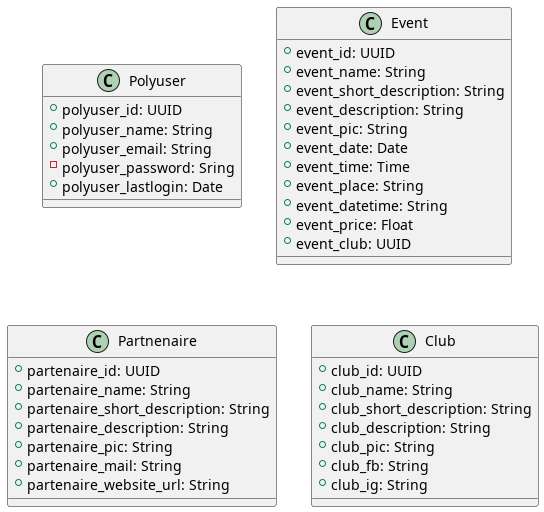
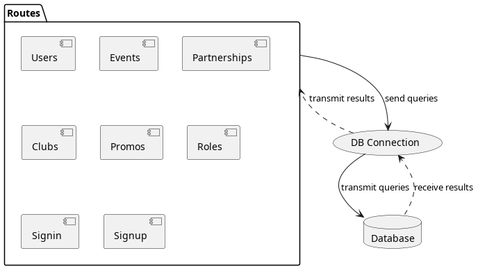
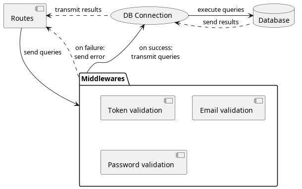

# API bde website
The front part is [here](https://github.com/iusildra/bde-website-front)

## Database architecture

## API architecture
### Common routes
The requests are dispatched upon reception following REST principles. Right now, as the v1 of the website is a showcase, most of the routes implement a basic CRUD.

Exception are for "Clubs" where the delete isn't available and Sign(in|up) which process only their specific functionnality

### Protected routes
However for some protected resources such as the list of users, the modification of elements... there is an identity and/or right permissions check

To manage the images, we use [cloudinary](https://cloudinary.com/). We must provide some credentials to access the API. The account used is a free plan, so we are limited to 25Gb of storage. This is more than necessary right now, but if we add the picture of the integration we may need to periodically remove some pictures. If we add the videos too, it will become mandatory to have API endpoints for admin to be able to delete old pictures/videos.
To this end, a panel must be added with a chart showing the current usage of the 25Gb and the date of upload. 